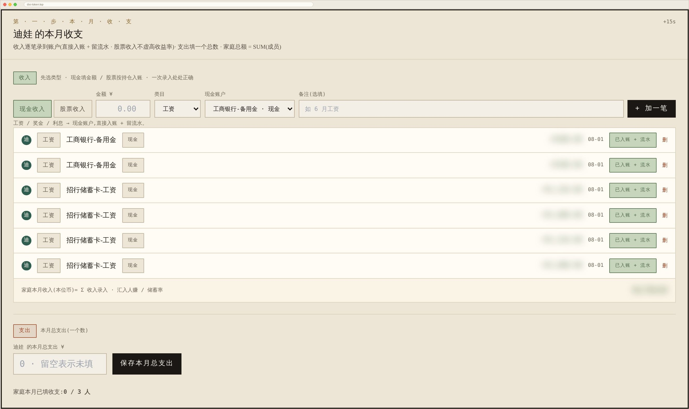

# 怎么记 · 常见场景对照手册

> 给没有财会背景的人看的。看完你应该能回答:**这笔钱到底要不要记、记在哪。**
>
> 想先了解**每月整体怎么走一遍**、以及**分析问题该往哪钻** → 见 [使用手册 · 主流程与分析路径](how-to-use.md)。
>
> 相关文档:[常见问题(部署 / 备份 / 账号 / AI)](faq.md) · [券商自动同步](broker-sync-guide.md)

---

## 一、先理解一件事:这里记的是「余额」,不是「流水」

大多数记账软件让你记**每一笔**钱:今天买菜 38 块、打车 22 块……

**这个软件不是。** 它每月只问你一句话:

> **月底了,你每个账户里各剩多少钱?**

你照实填一遍余额,它负责把这些数字合成一张全家总账,并算出:净资产变了多少、其中哪部分是你**攒**出来的、哪部分是投资**赚**出来的。

**为什么这么设计**:它分析的对象首先是**余额变动**。v1.8 起也可以逐笔录支出、看到构成,但那个构成停在「刚性 vs 日常」这一层,
不打算告诉你"这个月餐饮占了几成"——那件事微信、支付宝、银行 App 已经做得很好了。也正因为只需要几个数字,才做得到「每月 10 分钟,全家填完」。

**所以你不需要记流水。** 下面所有场景,基本都归结为"把月末余额填对"。

---

## 二、一条总原则(记住这句,九成问题自己就有答案了)

| | 算不算收入/支出 | 怎么记 |
|---|---|---|
| **钱在你自己的账户之间移动** 转账、买基金、卖股票、还房贷本金 | **不算** | 只影响各账户余额,照实填即可 |
| **钱真正进出你家** 工资、奖金、吃饭、房租、利息 | **算** | 收入逐笔录(选进账账户)· 支出填「本月总支出」一个总数 |

举个最容易搞混的例子:你从工资卡转 5 万去基金账户。**你并没有变穷也没有变富**,只是钱换了个地方待着 —— 所以它不是支出。如果错记成支出,你的储蓄率会凭空变难看,投资收益也会算错。

---

## 三、每月固定要做的三件事

1. **填余额** —— 填报页列出你所有账户,逐个填月末余额。
2. **录收入(逐笔)+ 填支出(一个总数)** —— 这两侧的填法**不一样**,见下。
3. **关账** —— 确认没问题后关账。关账后这一期才会进入收益率计算(进行中的账期不参与,因为收支通常还没录齐)。

### 收入和支出为什么填法不同

| | 怎么填 | 为什么这么设计 |
|---|---|---|
| **收入** | **逐笔录**:点「现金收入」或「股票收入」,填金额 + 类目 + **进了哪个账户** | 收入笔数少(工资、股息、利息),逐笔记得起来;而且录一笔就会**自动加进那个账户的余额**,省得你再去改余额 |
| **支出** | **两种方式,自己选**(家庭级开关 · 默认「总额」) | 见下 |

填报页「本月收支」区。上半部分是**逐笔收入**(金额 + 类目 + 进哪个账户,点「加一笔」),下半部分是**支出一个总数**。页面副标题就写着这条规则。图中金额已打码。

> **能不能不填?** 只填余额也能用,但**建议填**。因为「你攒的」= 收入 − 支出,「投资赚的」= 净资产变化 − 你攒的。少了这两个数,这两件事就分不开;另外「紧急储备够几个月」的分母正是月均支出,不填就算不出来。

---

## 四、常见场景对照表

先看这张表找到你的场景,细节看下面对应小节。

| 你做了什么 | 要不要记收支 | 具体怎么操作 |
|---|---|---|
| 发工资 / 收奖金 | **算收入** | 点「现金收入」逐笔录,选进账账户(会自动加进该账户余额) |
| 吃饭、房租、买东西 | **算支出** | 总额模式填进「本月总支出」· 逐笔模式逐笔录(选账户 + 类目「日常开支」)|
| 在基金账户里买了/卖了基金 | 不算 | **什么都不用做**,月末填余额即可 |
| 从银行卡转钱去基金账户 | 不算 | 用「账户间划转」 |
| 借了房贷 / 消费贷 / 跟亲友借钱 | 不算 | 建一个「贷款」账户 |
| 还房贷 | 本金不算,**利息算支出** | 贷款账户余额减少 + 现金减少,利息自动体现 |
| 借钱给别人 | 不算 | 建一个「其他」账户记应收 |
| 股票分红到账、理财到期收息 | 看钱去哪了 | 见「§4.7 利息和分红」 |
| 新加一个已经有钱的账户 | 不算 | 系统会自动识别为「开账基线」 |

#### 支出有两种填法(v1.8 起)

支出笔数远多于收入,强制逐笔会直接撑破「每月 10 分钟」这条硬约束。所以两种方式并存,在
**管理 → 提醒与模板 → 支出录入方式** 里切,默认「总额」(老用户升级后行为完全不变):

| 方式 | 怎么填 | 得到什么 |
|---|---|---|
| **总额**(默认) | 每位成员每月填一个「本月总支出」,从微信 / 支付宝 / 信用卡账单抄过来 | 储蓄率 / 紧急储备 / 人赚钱赚照常算,**没有构成** |
| **逐笔** | 每笔选账户 + 类目,自动从该账户余额扣除 | 上述全部 + **支出构成** + 账户级收益率更准(消费不再被当成投资亏损)|

**切换不动任何已录数据**:切到逐笔后原来填的总额还在(切回来立刻生效),切回总额后已录的逐笔也不删。

类目停在「性质」这一层 —— **日常开支 / 还贷 / 利息支出 / 转账给亲属**,不预置「餐饮」这类消费品类。
所以「支出构成」回答的不是「餐饮占几成」,而是「**刚性支出(还贷 + 利息)占多少、日常开支占多少**」。
对家庭账来说这个划分更有用:刚性压不下去,日常才是可调的那部分。想细分的家庭可以自己在管理页加类目。

##### ⚠ 逐笔录入会扣余额 —— 所以顺序是「先录收支,最后核对余额」

录一笔支出,系统会从所选账户余额里扣掉。如果你**已经**照银行 App 填了月末余额(那个数本来就
含这笔消费),再录这笔就会**扣第二次**,余额凭空少一笔。这和收入侧那个坑同源,记住顺序就不会踩。

##### ⚠ 支出的口径优先级与收入**相反**

| | 规则 |
|---|---|
| **收入** | 手填的总数 > 0 就用它,否则取逐笔流水汇总 |
| **支出** | **逐笔**模式:有逐笔就用逐笔,否则用手填总额;**总额**模式:用手填总额 |

方向是反的,这是历史造成的:收入的历史事实存在手填里,而支出的更细事实存在逐笔里。
两者**永不相加**。页面会标明当期用的是哪一种。

### 4.1 工资和日常消费

**工资到账(收入)** —— 在填报页点「现金收入」,填:金额、类目(工资 / 奖金 / 利息…)、**这笔钱进了哪个账户**。
录完这笔钱会**自动加进那个账户的余额**,你不用再手动去改余额。股息、理财利息同理;股票账户里的收入可以走「股票收入」。
页面顶部会实时显示「家庭本月收入 = Σ 收入录入」。

**日常消费(支出)** —— 默认(总额模式)每位成员各有一个「**本月总支出(一个数)**」的框,填一个总数就行。
切到逐笔模式后,这个框换成与收入区同构的逐笔表单(金额 + 类目 + 支出账户),并额外解锁报表页的「支出构成」。
填完页面会显示「家庭已填 N 人」,方便家里人互相看进度。

填了之后,报表页的「储蓄能力」段会自动给你:月均收入、月均支出、储蓄率、月储蓄能力、以及近 12 期的收支双柱图(没填的月份画成灰柱,并且不参与中位数计算)。

报表页 →「储蓄能力」。这些数字全部来自你填的那两侧收支。

### 4.2 基金 / 股票在同一个账户里买进卖出

**什么都不用做。**

你在某个基金账户里把 A 基金卖了买 B 基金,钱始终在这个账户里,月末余额自然反映了结果。系统只关心月末那个数。

### 4.3 从一个账户转钱到另一个账户

比如从工资卡转 5 万到证券账户准备买股票。

**用「账户间划转」**(填报页账户行内,或账户详情页里)。填:转出账户、转入账户、金额。跨币种时可以额外填对方账户实际到账的金额。

填报页的账户行 —— 填「本期余额」,同一行里还能记划转。

系统会把它当成"钱换了个位置",**不计入收入也不计入支出**,所以你的储蓄率和收益率都不会被带偏。

> 如果你嫌麻烦不记这笔划转,只是把两个账户的月末余额都填对,总净资产依然是对的 —— 但**账户级**的收益率会失真(转出的账户看起来"亏了 5 万",转入的看起来"赚了 5 万")。所以跨账户搬钱建议记一下。

### 4.4 借入:房贷 / 消费贷 / 跟亲友借钱

新建一个**「贷款」类型**的账户,余额填**还欠多少**。

> **填正数还是负数?都行。** 还欠 120 万,你填 `1200000` 或 `-1200000` 都会被存成「欠 120 万」,系统会自动处理符号,不会算错。

**借到手的那一刻**:现金账户多了 120 万,贷款账户欠了 120 万 —— **净资产不变**。这是对的,借来的钱不是你的收入。

### 4.5 还房贷

假设这个月还了 1 万,其中本金 8 千、利息 2 千。你不需要自己拆分,只要:

- 贷款账户余额:欠款减少 8 千
- 现金账户余额:减少 1 万

净资产因此减少 2 千 —— **正好等于利息**,自动体现,不用单独记。

> 报表页还有个「提前还贷决策器」,按 18 年 NPV 视角帮你算该不该提前还款。

### 4.6 借钱给别人

建一个**「其他」类型**账户,余额填对方还欠你多少(正数)。对方还钱时,这个账户余额减少、你的现金账户增加。

### 4.7 利息和分红

- **钱留在原账户里继续滚**(股息自动再投资、理财利息滚入本金):**不用单独录**,月末余额自然就涨了,系统会把它算作「投资赚的」。
- **钱作为一笔收入打进来了**(股息派到现金账户、存款利息入账):可以点「现金收入」录一笔,选择进账账户 —— 这样它会被算进「人赚的」而不是「投资赚的」。

这两种记法的差别只在于**归到「人赚的」还是「钱赚的」**,对净资产总额没有影响。按钱实际的去向选即可。

### 4.8 中途新增一个已经有钱的账户

比如你用了三个月之后,才想起来还有一张存了 20 万的银行卡没登记。

直接建账户、填 20 万即可。系统会自动把它识别为**「开账基线」**—— 这 20 万算作你**本来就有的本金**,不会被当成"这个月投资赚了 20 万"。收益率不会因为你补录账户而虚高。

### 4.9 逐笔持仓(可选,想更细的人看)

股票 / 基金 / 贵金属账户可以进一步登记**逐笔持仓**(代码 + 份额),系统每天自动拉价估值,你连月末余额都不用手填。

添加持仓时有个「**从账户现金划转买入**」选项:勾上并填买入成本,系统会自动从该账户的现金里扣掉「股数 × 成本」,省得你自己调。卖出时同理加回。

这一层完全是可选的 —— **只填账户余额也能把这个软件用好。**

---

## 五、常见疑问

**Q:我的账户收益率显示 0%,是算错了吗?**
不是。通常是因为:期末价值和上期持平、这个账户是本期才有的(没有上一期做起点)、或者没有任何买入卖出现金流。此时数学上回报率就是 0,后面账期价值一变就有意义了。

**Q:净资产明明涨了,为什么「钱赚的」是负数?**
说明这个月资产的增长全靠你往里存钱(人赚的),投资本身是亏的。这正是这个软件想帮你看清的事 —— 把"工资攒的"和"投资赚的"分开。

**Q:某个账户这个月忘填了会怎样?**
系统会沿用它上一期的余额,不会出现缺口。但如果这个账户实际有变动,数字就不准了 —— 填报页会提示哪些还没填。

**Q:进行中的这个月,为什么收益率指标看起来没更新?**
收益类指标(本月资产收益 / XIRR / 资产年化 / 人赚钱赚)只统计**已关账**的账期。因为填报中的月份通常余额已填、收支还没录,拿它算收益会把"还没录的收支"当成投资收益。相关卡片上会标明口径期是哪个月。

**Q:我想看支出分类占比(餐饮多少、居住多少)?**
目前不支持,支出只到「每月一个总数」这一层。这项需求已经收到,在排期中。

---

## 六、手机上也能填

填报是响应式的,通勤路上用手机填完全没问题;iOS 上还可以「添加到主屏幕」当 App 用。

---

## 七、一句话总结

> **月末把每个账户还剩多少填对,收入逐笔录一下(会自动入账),支出填一个总数,就够了。**
> 钱在自己账户之间怎么倒腾,都不用记。
