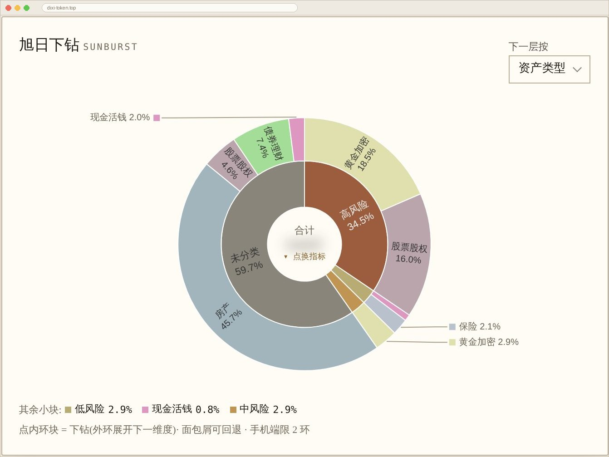
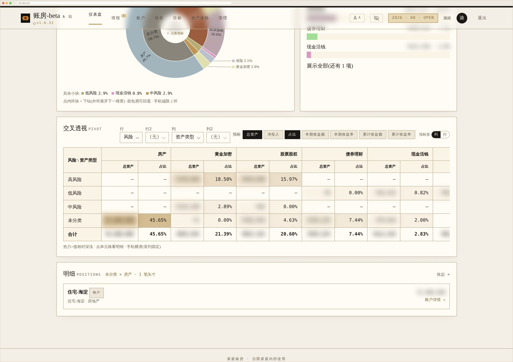

# 使用手册 · 主流程与分析路径

> 这个软件有两种用法,分开看:
>
> - **每月一次「录入」** —— 10 分钟把数字填进去。流程固定,照做即可。见[第一部分](#第一部分--月度主流程)。
> - **随时「分析」** —— 带着一个具体问题去钻。路径不固定,但有套路。见[第二部分](#第二部分--分析路径)。
>
> 只想知道"某笔钱该怎么记"→ 直接看 [怎么记 · 常见场景对照手册](how-to-record.md)。

---

# 第一部分 · 月度主流程

## 时间轴:一个月里各阶段发生什么

| 时点 | 你要做的 | 大概花多久 | 系统替你做了什么 |
|---|---|---|---|
| **月初 1 号** | 什么都不用做 | — | 自动开新账期、按上月账户生成「填余额」待办、贷款账户按月供预填 |
| **月初任意一天** | **流程 1 · 填报** | ~10 分钟 | 收入直接入账户、支出汇总到家庭、持仓自动估值 |
| 填完当下 | **流程 2 · 自查并关账** | ~1 分钟 | 显示「已填 N/M 人」、哪些账户还没填 |
| 关账后 | **流程 3 · 看这个月发生了什么** | ~5 分钟 | 全部指标刷新,这一期才纳入收益计算 |
| 每季 / 半年 | **流程 4 · 体检与调仓** | ~15 分钟 | AI 四维诊断 + 调仓建议 + 目标进度 |
| 不定期 | **流程 5 · 事件驱动** | 视情况 | 新增账户自动识别为「开账基线」,不虚高收益 |

---

## 流程 1 · 每月填报(顺序很重要)

进入 **填报页**,按这个顺序做,能少返工:

### 第 1 步:先录收入(逐笔)

点「现金收入」或「股票收入」,填 **金额 + 类目 + 这笔钱进了哪个账户**,点「加一笔」。

**为什么先做这步**:录一笔收入,系统会**立即把这笔钱加进那个账户的余额**(实测:录入 1 万 → 该账户余额 +1 万),同时留下一条流水。工资、奖金、股息、利息都这么记。

### 第 2 步:再填支出(一个总数)

每位家庭成员各有一个「本月总支出(一个数)」的框。从微信 / 支付宝 / 信用卡账单抄一个总数进去就行,**不用拆分类、不用逐笔**。

### 第 3 步:最后核对各账户余额

这时再逐个账户核对月末余额。收入已经在第 1 步自动进去了,通常只需要确认,或补上系统不知道的变动(比如消费扣款)。

> ⚠️ **顺序反了会重复计算**
> 如果你**先**把月末余额填成"已经含了工资"的真实数,**再**去录那笔工资收入 —— 系统会把工资**再加一次**,该账户余额凭空多一份。
> 记住:**收入录入会改余额,所以先录收入、后核余额。**

### 可以省掉第 3 步的情况

股票 / 基金 / 贵金属账户如果登记了**逐笔持仓**(代码 + 份额),系统每天自动拉价估值,余额不用手填。详见 [怎么记 §4.9](how-to-record.md#49-逐笔持仓可选想更细的人看)。

---

## 流程 2 · 自查并关账

填报页会显示 **「家庭本月已填收支:N / M 人」** 和哪些账户还没填。都齐了就关账。

**关账不是走形式** —— 收益类指标(本月资产收益 / 家庭 XIRR / 资产年化 / 人赚钱赚)**只统计已关账的账期**。因为填报中的月份通常是"余额填了、收支还没录齐",拿它算收益会把没录的收支当成投资收益。

所以:**没关账 = 这个月不进收益统计**,页面上会标明当前算的是哪一期。

---

## 流程 3 · 关账后,5 分钟看这个月发生了什么

推荐这个顺序看,由粗到细:

| 顺序 | 去哪 | 回答什么 |
|---|---|---|
| 1 | **仪表盘 · 概览** | 净资产多少、环比涨跌多少、紧急储备够几个月 |
| 2 | **仪表盘 · 人赚 vs 钱赚** | 这个月资产变化里,多少是工资攒的、多少是投资赚的 |
| 3 | **仪表盘 · 归因复盘** | 变化具体由谁贡献 —— 可切 账户 / 成员 / 平台 / 币种 / 账户类型 五个视角 |
| 4 | **仪表盘 · 资产洞察** | 系统自动给的提示(负债率偏高、应急金不足、过度集中…) |

一句话:**先看总数,再看构成,最后看是谁造成的。**

---

## 流程 4 · 每季度 / 半年:体检与调仓

| 顺序 | 去哪 | 回答什么 |
|---|---|---|
| 1 | **资产体检** | 配置 / 风险 / 流动性 / 收益 四维诊断,可下钻到单个账户 |
| 2 | **报表 · 资产配置对照** | 现在的配置 vs 你设定的目标,偏离多少 |
| 3 | **报表 · 调仓建议与计划** | 具体动作:「从 X 调 ¥N 到 Y」 |
| 4 | **财务目标** | FIRE / 子女教育 / 应急储备 的进度与三情景预测 |

---

## 流程 5 · 事件驱动(不定期)

| 发生了什么 | 去哪做 | 注意 |
|---|---|---|
| 想起还有账户没登记 | 账户页新建,填当前余额 | 系统自动识别为「开账基线」,当作**本来就有的本金**,不会算成这个月投资赚的 |
| 买房 / 借贷 | 建「贷款」类型账户 | 填正数负数都行,系统自动处理符号 |
| 换券商 / 开新平台 | 建账户,可接券商自动同步 | 见 [券商同步图文向导](broker-sync-guide.md) |
| 大额跨账户搬钱 | 用「账户间划转」 | 不记的话账户级收益率会失真 |
| 持仓太多懒得手输 | 填报页「AI 截图智能填报」 | 上传持仓截图,视觉模型识别名称 + 市值 |

---

# 第二部分 · 分析路径

## 我想知道… 该去哪

| 你的问题 | 去哪 | 
|---|---|
| 这个月净资产变化是**谁**造成的 | 仪表盘 · 归因复盘 |
| 我是**靠工资攒的还是靠投资赚的** | 仪表盘 · 人赚 vs 钱赚 → 报表 · 本金 vs 投资损益 |
| 我的投资**跑赢基准**了吗、哪个账户拖后腿 | 报表 · 账户级收益 vs 基准 |
| 我家**高风险资产**有多少、谁在管、具体哪几笔 | 资产透视(见下方[路径 A](#路径-a--高风险资产在谁手上具体是哪几笔)) |
| 我是不是**押注了单一行业** | 资产透视 ·「行业集中」看板(基金会穿透到真实行业) |
| 钱**够花几个月** | 资产体检 · 紧急储备 / 透视 ·「流动性」看板 |
| **扣掉通胀**,我真的变富了吗 | 报表 · 财富水位(CPI 购买力线 + M2 社会财富线) |
| 该不该**提前还房贷** | 报表 · 提前还贷决策器(18 年 NPV 视角) |
| 我离 **FIRE** 还有多远 | 财务目标 |
| 配置**偏离**目标了吗、怎么调 | 报表 · 资产配置对照 → 调仓建议 |

---

## 资产透视:四个组件怎么配合

「资产透视」是最强的分析面,但要先搞清它的四个组件各自干什么 —— 很多人卡在"点了旭日却看不到明细":

| 组件 | 作用 | 关键点 |
|---|---|---|
| **A 旭日图** | 两层维度的占比全貌。**点内环的块 = 下钻**(把它加进筛选条件,外环随之展开下一维度) | 右上角可选「下一层按」哪个维度;**点圆心换度量**;面包屑逐级回退;手机端只显示 2 环。标着「其他 N 项」的是把太小的块合并显示的,**不能再钻** —— 看完整列表请用切片排行 |
| **B 切片排行** | 当前范围内某个维度的**完整**排序列表 | 旭日里被合并掉的小项在这里都能看到 |
| **C 交叉透视** | 行 × 列 交叉成表,热力深浅表示大小 | 行和列各可再加一级(**行2 / 列2**),即最多四个维度嵌套;**指标可多选**(如同时看「总资产 + 占比」),共 7 种:总资产 / 净投入 / 占比 / 本期收益额 / 本期收益率 / 累计收益额 / 累计收益率;还能切「指标放列 / 放行」;手机横滑,首列固定 |
| **D 明细抽屉** | 列出具体每一笔头寸 | **只能从交叉透视的格子点开** —— 这是钻到"具体哪个持仓"的唯一入口 |

**可用维度(10 个)**:资产类型 · 平台 · 行业 · 主理人 · 用途 · 风险 · 流动性 · 币种 · 地域 · 账户类型
其中**行业**和**地域**是持仓级维度(基金会穿透到背后的真实持仓再归类)。

**预设看板(10 块)**,本质是帮你预先摆好旭日的两层维度:

| 看板 | 旭日两层 | 交叉透视预置(行 × 列) | 适合回答 |
|---|---|---|---|
| **成员结构** | 主理人 → 平台 | 主理人 × 资产类型 | 谁管着多少钱、放在哪些平台 |
| **资产类型** | 资产类型 → 风险 | 资产类型 × 主理人 | 钱是什么、各自风险几何 |
| **风险总览** | 风险 → 资产类型 | 风险 × 资产类型 | 高风险占比多少、具体是什么 |
| **平台安全** | 平台 → 资产类型 | 平台 × 资产类型 | 是不是把鸡蛋放一个篮子 |
| **行业集中** | 行业 → 平台 | 行业 × 平台 | 有没有押注单一行业 |
| **资金用途** | 用途 → 主理人 | 用途 × 资产类型 | 每笔钱为谁 / 为什么服务 |
| **流动性** | 流动性 → 资产类型 | 流动性 × 主理人 | 急用钱时能拿出多少 |
| **币种敞口** | 币种 → 地域 | 币种 × 资产类型 | 汇率敞口 |
| **市场地域** | 地域 → 行业 | 地域 × 行业 | 海外配置情况 |
| **账户类型** | 账户类型 → 主理人 | 账户类型 × 主理人 | 记账口径视角 |

> 选一块看板 = 一次把旭日的两层维度**和**交叉透视的行列都摆好。之后想换随时可以改,看板只是起点。

---

## 路径 A · 高风险资产在谁手上、具体是哪几笔

这是最典型的一条"从全貌钻到单笔"的路径。

**第 1 步 · 选看板**
进入「资产透视」,点预设看板 **「风险总览」**。旭日内圈按风险等级分块,外圈是该风险等级下的资产类型。
一眼看到:高风险占全家多少比例。

「风险总览」看板下的旭日图。内圈=风险等级(此例高风险 34.5%),外圈=该风险下的资产类型。右上「下一层按」换维度,圆心可换度量。注意这份演示数据里「未分类」占 59.7% —— 说明没打标的资产会让风险视图失真。

**第 2 步 · 点「高风险」块下钻**
点**内环**的「高风险」扇区 —— 它被加进上方的**筛选栈**,之后所有组件(排行 / 透视 / 明细)都只统计这部分钱。面包屑可以随时退回。

**第 3 步 · 换个维度看这批钱**
用旭日右上角的「下一层按」把维度换成 **主理人** —— 立刻看到这批高风险资产在家庭成员之间怎么分。

> **如果内环出现一大块「未分类」**,说明这些资产还没打风险标签,风险视图会失真。去「资产打标」补一下即可,支持 AI 推荐打标;基金还能穿透后按真实持仓归类。

**第 4 步 · 交叉透视定位**
拉到下方「交叉透视」。「风险总览」看板已经把它预置成 **风险 × 资产类型**;既然第 2 步已经筛出高风险了,这里把行改成 **主理人**、列改成 **行业**(或平台)更有信息量。度量先用「总资产」。
表格会告诉你:比如"配偶 × 半导体"这一格特别大。
> 想知道这批高风险资产**赚没赚钱**?把指标加上「累计收益率」—— 指标是多选的,可以让「总资产」和「累计收益率」并排显示,一眼看出"钱多的那格是不是也在亏"。

**第 5 步 · 点格子,落到具体持仓**
点那个格子 → 弹出**明细抽屉**,列出该格里的每一笔头寸:名称、是「持仓」还是「账户」、所属账户 · 平台 · 行业、金额,按金额从大到小排。抽屉标题会写明当前范围,例如「共同 × 房产 · 1 笔头寸」。

交叉透视(热力深浅=值大小)+ 点开格子后的明细抽屉。这是钻到「具体哪个持仓」的唯一入口。

**第 6 步 · 进账户看细节**
每条右下角有「账户详情 →」,点进去是该账户的跨期流水档案;股票类账户还能进「持仓管理」看逐笔持仓和自动估值。

**这一路下来你得到的结论形如**:
> 我家高风险资产占 32%,其中 6 成在配偶名下,集中在半导体行业,具体是富途账户里的这 3 支股票,累计收益率 −12%。

---

## 路径 B · 这个月净资产变化,是谁造成的

**仪表盘 → 归因复盘**。它把这个月的净资产变化拆到各个贡献方,可切五个视角:**账户 / 成员 / 平台 / 币种 / 账户类型**,并且有 12 期趋势。

用法:先看「账户」视角找出变化最大的那个账户,再切「成员」看是谁那边的波动,最后回到账户详情看具体发生了什么。

> 归因回答的是「**变化从哪来**」,和「人赚 vs 钱赚」回答的「**变化是什么性质**」互补 —— 两个一起看才完整。

---

## 路径 C · 我是靠工资攒的,还是靠投资赚的

1. **仪表盘 · 人赚 vs 钱赚** —— 本期一眼:`净资产变化 = 人赚的 + 钱赚的 + 开账基线`
2. **报表 · 本金 vs 投资损益** —— 拉长到整个区间,看累计净投入和累计投资损益的分道曲线

如果「钱赚的」长期为负而净资产还在涨,说明资产增长完全靠往里存钱,投资本身在亏 —— 这正是这个软件想让你看见的事。

---

## 路径 D · 跑赢基准了吗,谁拖后腿

**报表 → 账户级收益 · vs 基准**。每个账户一行:当前价值、收益率、对标基准(来自产品类目)、跑赢 / 跑输多少个百分点。

- 基准来自「产品类目」的长期年化基准,可在管理页微调
- 不满 12 期时,基准会**按窗口折算**再比较,不会拿年化基准硬套三个月的收益
- 手机上这张表是卡片形式,点「展开」看全部指标

---

## 路径 E · 扣掉通胀,我真的变富了吗

**报表 → 财富水位**。在净资产曲线上叠两条线:

- **CPI 购买力线** —— 你现在的钱,还买得起当年同样的生活吗
- **M2 社会财富线** —— 你在社会财富里的相对位置,是升还是降

名义上涨 8% 但跑输 M2,意味着你的相对位置其实在退。

---

# 第三部分 · 记账速查

某笔钱到底怎么记(工资 / 买卖基金 / 借钱还贷 / 账户间转钱 / 利息分红 / 补录老账户)—— 见 **[怎么记 · 常见场景对照手册](how-to-record.md)**。

一句话原则先记住:

> **钱在你自己账户之间移动** → 不是收支,只影响余额
> **钱真正进出你家** → 才是收支
